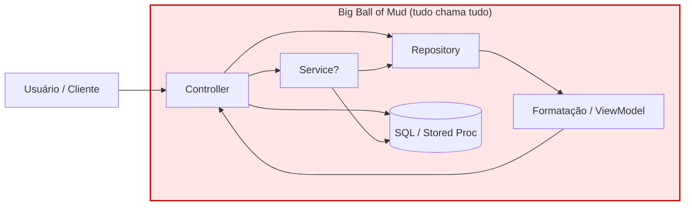
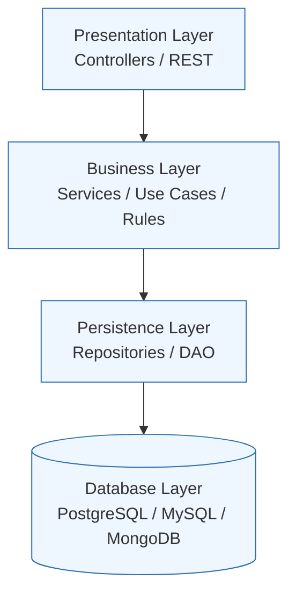
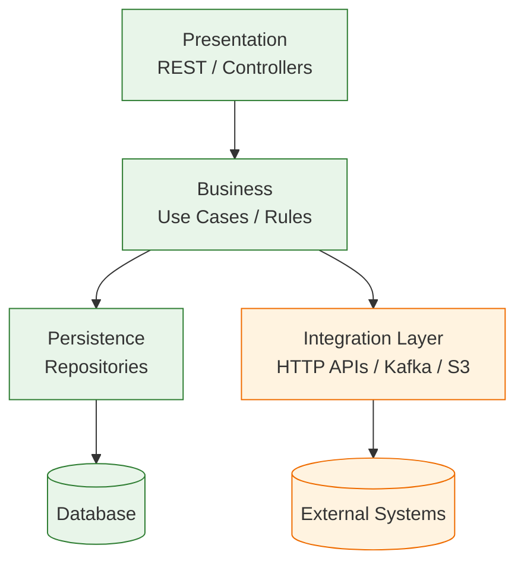
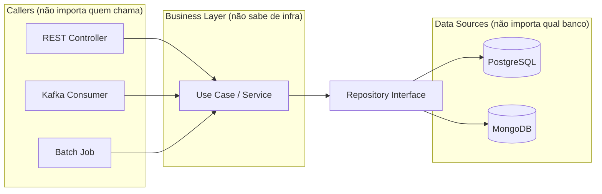
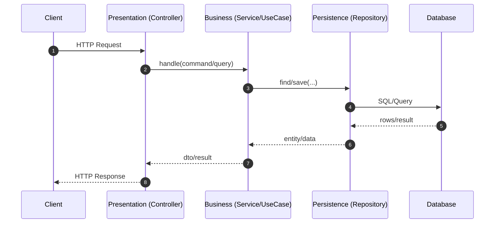
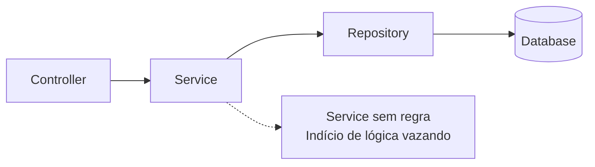
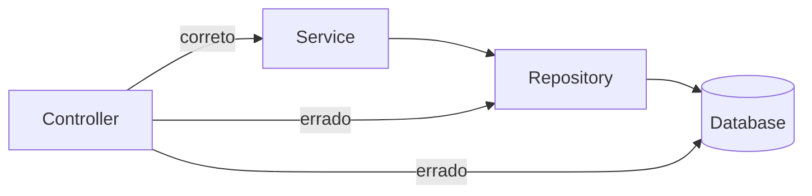
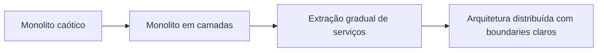

# layered-architecture-pattern

Reference implementation of **Layered (N-Tier) Architecture**.

## Run (Docker)
```bash
docker compose up --build
```

## Endpoints
- POST /tasks
  ```json
  { "title": "estudar layered architecture" }
  ```
- GET /tasks

## Package structure
- presentation: controllers + DTOs
- business: rules/use cases/services
- persistence: entities + repositories
- integration: external clients (HTTP/Kafka/S3)


# Architecture Patterns #3 — Layered (N-Tier)

## 1. O problema

Quando um sistema cresce sem organização estrutural clara, o caos surge de maneira previsível:

- Regra de negócio dentro de controllers  
- Query SQL misturada com lógica de apresentação  
- Classes gigantes responsáveis por múltiplas funções  
- Dependências cruzadas imprevisíveis  

Qualquer alteração se torna arriscada, porque não existe clareza sobre impacto.

O problema fundamental é a ausência de separação de responsabilidades.

Quando tudo pode chamar tudo, o sistema se transforma em uma **Big Ball of Mud**.

### Big Ball of Mud



---

## 2. A solução conceitual

A arquitetura em camadas divide o sistema horizontalmente.  
Cada camada possui responsabilidade clara e comunicação direcionada.

Regra fundamental:

- Uma camada conhece apenas a camada imediatamente abaixo.
- A camada de negócio não conhece infraestrutura.
- A apresentação não contém regra de negócio.

### Modelo clássico — 4 camadas



---

### Variação com camada de integração



---

## Regra de ouro

A camada de negócio:

- Não sabe quem a chama
- Não sabe qual banco está sendo usado
- Não sabe qual tecnologia externa está envolvida



---

## Fluxo correto de execução



---

## 3. Trade-offs

### Use quando:

- O sistema possui complexidade de negócio moderada
- O time precisa de convenção clara
- Testabilidade é importante
- Você quer estrutura sem over-engineering

### Evite quando:

- O domínio é altamente complexo (DDD e Hexagonal são mais adequados)
- A regra de negócio é trivial
- Performance crítica exige reduzir overhead de camadas

---

## Erros comuns

### 1. Service como repositório glorificado

Quando o Service apenas delega para o Repository sem regra alguma.



---

### 2. Pular camadas

Quando o Controller chama o Repository diretamente.



---

## 4. Case — eBay

O eBay, no início dos anos 2000, operava como um grande monolito com regras espalhadas.

Antes de migrar para distribuição e serviços, a primeira grande refatoração foi impor disciplina arquitetural em camadas dentro do próprio monolito.

Essa separação permitiu:

- Identificar fronteiras claras
- Isolar responsabilidades
- Extrair serviços com segurança



---

## Conclusão

Você não salta de Big Ball of Mud diretamente para microsserviços.

Layered Architecture é frequentemente o passo intermediário necessário para:

- Estabilizar fronteiras
- Organizar responsabilidades
- Tornar o sistema testável
- Permitir evolução arquitetural futura

Ela não é a solução final para todo sistema, mas é a base estrutural mais comum e didática da engenharia de software moderna.
